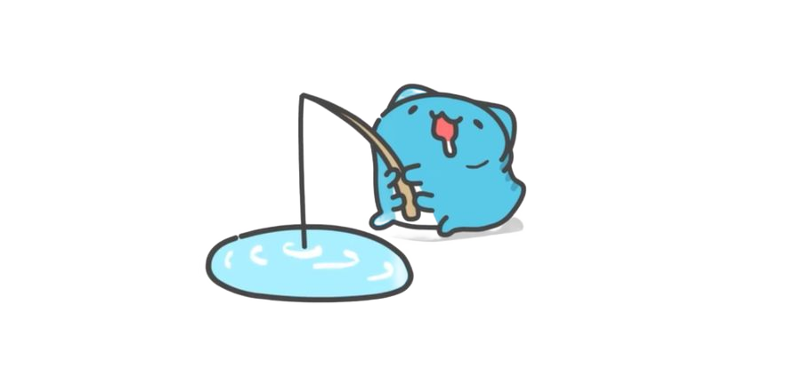

先说好，这个测试是我用AI写的，能用就行了。


这是一篇全面测试 Markdown 各种格式的文章，包含表格、列表、引用、代码块等丰富内容。

## 📊 表格测试

### 基础表格

| 姓名 | 年龄 | 职业 | 城市 |
|------|------|------|------|
| 张三 | 25 | 程序员 | 北京 |
| 李四 | 30 | 设计师 | 上海 |
| 王五 | 28 | 产品经理 | 深圳 |


### 对齐方式测试

| 左对齐 | 居中对齐 | 右对齐 | 默认对齐 |
|:-------|:--------:|-------:|---------| 
| 这是左对齐的文本 | 这是居中的文本 | 这是右对齐的文本 | 默认对齐 |
| 短文本 | 中等长度的文本内容 | 非常非常长的文本内容示例 | 普通文本 |

## 📝 列表测试

### 无序列表

- 🍎 水果类
  - 苹果
    - 红富士
    - 青苹果
  - 香蕉
  - 橙子
- 🥬 蔬菜类
  - 白菜
  - 萝卜
  - 土豆

### 有序列表

1. **前端开发流程**
   1. 需求分析
   2. UI/UX 设计
      1. 原型设计
      2. 视觉设计
      3. 交互设计
   3. 代码实现
   4. 测试部署

2. **后端开发流程**
   1. API 设计
   2. 数据库设计
   3. 业务逻辑实现
   4. 接口测试

### 任务列表

- [x] 完成页面布局
- [x] 实现响应式设计
- [ ] 添加动画效果
- [ ] 性能优化
- [ ] 单元测试
  - [x] 组件测试
  - [ ] 集成测试
  - [ ] E2E 测试

## 💬 引用测试

### 普通引用

> 这是一个简单的引用块，用来展示引用的基本样式。
> 
> 引用可以跨越多行，保持良好的可读性。

### 嵌套引用

> 这是外层引用
> 
> > 这是嵌套的引用
> > 
> > > 这是更深层的嵌套引用
> 
> 回到外层引用

### 引用中包含其他格式

> **重要提醒：**
> 
> 在开发过程中需要注意以下几点：
> 
> 1. 代码规范
> 2. 性能优化
> 3. 安全防护
> 
> ```javascript
> // 引用中的代码示例
> const importantNote = "注意代码质量";
> ```

## 💻 代码测试

### 行内代码

这里有一些行内代码：`const variable = "value"`，以及 `npm install` 命令。

### 代码块

#### JavaScript 代码

```javascript
// 复杂的 JavaScript 示例
class TodoApp {
  constructor() {
    this.todos = [];
    this.filter = 'all';
  }

  addTodo(text) {
    const todo = {
      id: Date.now(),
      text: text.trim(),
      completed: false,
      createdAt: new Date()
    };
    this.todos.push(todo);
    this.render();
  }

  toggleTodo(id) {
    const todo = this.todos.find(t => t.id === id);
    if (todo) {
      todo.completed = !todo.completed;
      this.render();
    }
  }

  render() {
    // 渲染逻辑
    console.log('Rendering todos:', this.todos);
  }
}
```

#### CSS 代码

```css
/* 响应式表格样式 */
.table-container {
  overflow-x: auto;
  margin: 1rem 0;
}

.responsive-table {
  width: 100%;
  border-collapse: collapse;
  box-shadow: 0 2px 8px rgba(0, 0, 0, 0.1);
}

.responsive-table th,
.responsive-table td {
  padding: 12px 16px;
  text-align: left;
  border-bottom: 1px solid #e0e0e0;
}

.responsive-table th {
  background-color: #f5f5f5;
  font-weight: 600;
  color: #333;
}

@media (max-width: 768px) {
  .responsive-table {
    font-size: 14px;
  }
  
  .responsive-table th,
  .responsive-table td {
    padding: 8px 12px;
  }
}
```

#### Python 代码

```python
# 数据处理示例
import pandas as pd
import numpy as np
from datetime import datetime

class DataProcessor:
    def __init__(self, data_source):
        self.data_source = data_source
        self.processed_data = None
    
    def load_data(self):
        """加载数据"""
        try:
            self.raw_data = pd.read_csv(self.data_source)
            print(f"数据加载成功，共 {len(self.raw_data)} 行")
        except Exception as e:
            print(f"数据加载失败: {e}")
    
    def clean_data(self):
        """数据清洗"""
        # 移除重复数据
        self.processed_data = self.raw_data.drop_duplicates()
        
        # 处理缺失值
        self.processed_data = self.processed_data.fillna(method='ffill')
        
        return self.processed_data
```

## 🔗 链接测试

### 基础链接

这里有一些链接示例：
- [GitHub](https://github.com)
- [Stack Overflow](https://stackoverflow.com)
- [MDN Web Docs](https://developer.mozilla.org)

### 带标题的链接

访问 [OpenAI 官网](https://openai.com "OpenAI 人工智能公司") 了解更多信息。

### 参考链接

这是一个参考链接示例[^1]，还有另一个[^2]。

[^1]: 这是第一个参考链接的说明
[^2]: 这是第二个参考链接的详细说明

## 🎨 文本格式测试

### 强调和重点

- **粗体文本**
- *斜体文本*
- ***粗斜体文本***
- ~~删除线文本~~
- `行内代码`
- ==高亮文本==（如果支持）

### 特殊字符

- 版权符号：©
- 注册商标：®
- 商标符号：™
- 度数符号：°
- 箭头：→ ← ↑ ↓
- 数学符号：± × ÷ ≠ ≤ ≥

## 📸 媒体测试

### 图片



## 📋 总结

这篇文章展示了 Markdown 的各种格式：

| 格式类型 | 测试内容 | 状态 |
|----------|----------|------|
| 表格 | 基础表格、复杂表格、对齐 | ✅ 已测试 |
| 列表 | 有序、无序、任务列表 | ✅ 已测试 |
| 引用 | 简单、嵌套、混合格式 | ✅ 已测试 |
| 代码 | 行内、多语言代码块 | ✅ 已测试 |
| 链接 | 普通、带标题、参考链接 | ✅ 已测试 |
| 格式 | 粗体、斜体、删除线等 | ✅ 已测试 |

通过这个测试文件，可以验证 prose 样式对各种 Markdown 格式的支持情况。